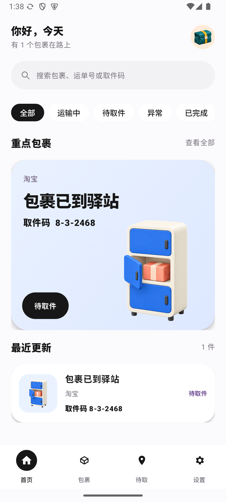
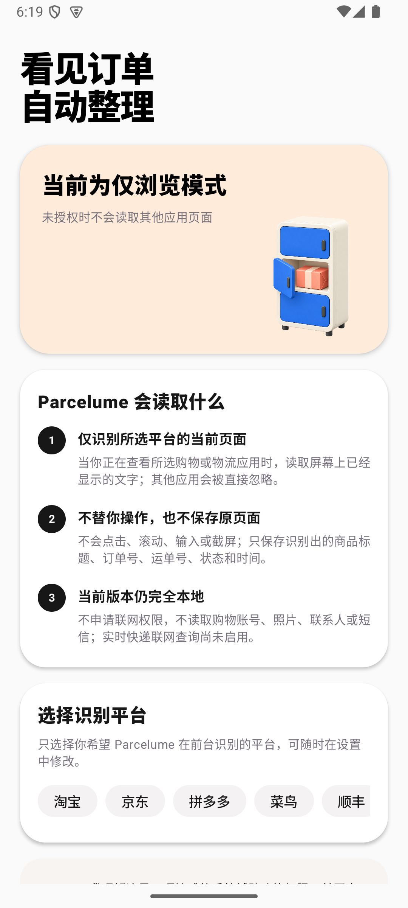
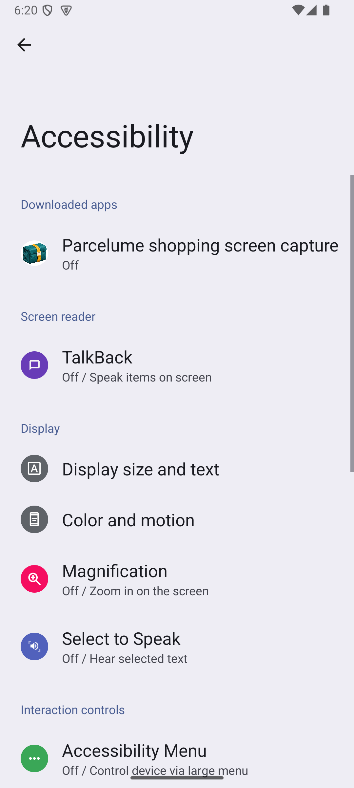

# Parcelume

> 一款隐私优先、完全本地运行的 Android 包裹收件箱。

简体中文 · [English](README.md)

Parcelume 会把用户所选购物应用当前页面上已经显示的订单与物流信息，整理成一个安静、清晰、可搜索的包裹时间线。在 Android 上，用户主动授权的页面识别是主要来源，通知只是可选补充。它不要求注册 Parcelume 账号，也不连接服务器。

> [!IMPORTANT]
> Parcelume 目前是 Android 早期测试版本。它只能识别完成设置后由用户实际打开的受支持订单或物流页面，不能读取其他应用的私有订单数据库、导入从未打开过的历史订单、承诺绝不遗漏，也暂时不能提供实时联网物流更新。

## 核心特点

- **购物时自动整理**：受支持的订单或物流页面显示时自动提取必要字段。
- **通知作为补充**：通知访问不再是唯一信息来源，可以选择不开启。
- **完全本地**：结构化记录只保存在手机本地 SQLite 数据库中。
- **没有联网权限**：当前版本无法上传通知或包裹数据。
- **来源可控**：没有被用户选中的应用会在解析前直接忽略。
- **仅浏览模式**：拒绝授权后仍可查看界面，同时持续显示权限提醒。
- **保留时间可选**：已完成记录可保留一周、一个月、一年或永久。
- **中英文界面**：只切换语言，不改变功能和设计。

## 界面预览

| 包裹首页 | 权限说明 | Android 系统授权 |
| --- | --- | --- |
|  |  |  |

## 工作原理

```text
所选应用当前可见的订单或物流页面
        ↓
Android 辅助功能服务（只读使用）
        ↓
手机本地规则解析器
        ↓
SQLite 中的必要结构化字段
        ↓
Parcelume 包裹与待取页面
```

Parcelume 可能提取来源、商品标题、订单号、物流状态、运单号、取件码和更新时间。页面与通知原文只在内存中处理，不会写入数据库。识别服务不会点击、滚动、输入、执行手势或截屏。

## 下载测试版

可在预览版本页面下载 [`parcelume-0.2.0-debug.apk`](https://github.com/MalphtieYU/parcelume-android/releases/tag/v0.2.0-preview)。这是使用 Debug 签名的功能测试包，不是正式发行版。安装时 Android 可能要求允许浏览器或文件管理器“安装未知应用”；请只对你信任的安装来源临时开启，安装后可再关闭。

## 使用方法

1. 在 Android 8.0 或更高版本的设备上安装 APK。
2. 打开 Parcelume，阅读醒目的购物页面识别说明。
3. 只选择你允许 Parcelume 处理的购物或物流应用。
4. 勾选同意后点击“开启购物页面识别”。
5. Parcelume 会打开真正的 Android 辅助功能设置；选择 Parcelume 并在系统界面亲自授权，然后返回应用。
6. 在所选应用中打开下单成功、订单详情或物流页面，匹配字段会在本地自动整理。
7. 可以选择开启通知访问，作为页面识别的辅助来源。

如果选择“暂不开启，仅浏览界面”，应用仍可正常进入；在页面识别和来源没有配置完整之前，首页会一直显示提醒。

## 系统权限说明

页面识别与通知访问权限都完全由 Android 系统控制，Parcelume 无法静默授权。

- 主按钮会打开 Android 辅助功能设置，用户必须亲自开启“Parcelume 购物页面识别”。
- Android 会显示范围较广的辅助功能系统警告；Parcelume 在代码中把实际行为收窄为固定支持包名、用户所选来源、当前可见文字、不执行手势、不保存原始页面。
- 可选的通知辅助功能在 Android 11 及以上优先打开 Parcelume 的通知访问详情页，其他设备会回退到通知访问列表或系统设置。

三星、小米、OPPO、vivo、华为、荣耀、一加、Google Pixel 等系统的菜单名称可能不同。部分厂商还可能要求用户在电池或自启动设置中允许后台运行。Parcelume 不会为了绕过厂商限制而申请与功能无关的权限。

## 隐私边界

| 项目 | Parcelume 的处理方式 |
| --- | --- |
| 网络 | 不申请 `INTERNET` 或 `ACCESS_NETWORK_STATE` 权限 |
| 账号 | 没有 Parcelume 账号、登录和云同步 |
| 页面范围 | Android 的辅助功能授权本身较宽；Parcelume 会先按固定支持包名和用户所选来源过滤，再解析当前可见文字 |
| 页面操作 | 不点击、不执行手势、不滚动、不输入、不悬浮、不截屏 |
| 通知范围 | 仅作为可选补充；未选择来源会在解析通知字段前直接忽略 |
| 本地存储 | 只保存提取后的包裹字段，不保存页面树、完整通知、截图或附件 |
| 其他个人数据 | 不读取联系人、短信、照片、位置，不使用无障碍服务，不索取购物平台密码 |
| 删除方式 | 用户可设置保留时间，也可以一键删除全部本地数据 |

完整边界请查看[隐私说明](docs/PRIVACY.zh-CN.md)。

## 当前支持来源

MVP 已包含淘宝、京东、拼多多、菜鸟、顺丰和 Amazon Shopping 通知的本地识别规则。

“支持”表示 Parcelume 可以识别已知页面和通知格式，并不表示本项目与这些公司存在合作或代表关系。页面布局、文案、自定义渲染方式、地区和版本变化都会影响准确率。

## 注意事项与限制

- 过去或隐藏的订单不会自动导入，除非用户亲自打开可识别页面。
- 部分自定义渲染或受保护页面不会向 Android 辅助功能暴露可读取文字。
- Parcelume 不控制其他应用，也不会代替用户自动跳转页面。
- 0.2 尚未接入实时快递查询，状态更新仍需要再次识别页面或通知。
- 不同地区和应用版本的布局、文案和包名可能不同。
- 无障碍权限需要醒目同意，公开应用商店发行前还需要额外的政策审核。
- 当前 Debug APK 仅供测试，不是正式签名发行版。

## 从源码构建

需要：带 Android SDK 37 的 Android Studio、JDK 17，以及 Android 8.0 及以上设备或模拟器。

```bash
git clone https://github.com/MalphtieYU/parcelume-android.git
cd parcelume-android
./gradlew assembleDebug
```

APK 生成位置：`app/build/outputs/apk/debug/app-debug.apk`。

运行测试与检查：

```bash
./gradlew testDebugUnitTest lintDebug
```

## 项目状态

当前 MVP 已完成 Android 15 模拟器界面与真实辅助功能授权流程测试、页面与通知解析器单元测试、Android Lint、数据库升级安装测试和 Manifest 无联网权限检查。在发布稳定版本前，仍需使用真实购物页面以及不同厂商手机完成脱敏兼容性验证。

## 参与贡献

欢迎提交 Issue 和 Pull Request，尤其是脱敏后的通知格式说明、解析器测试和设备兼容性反馈。请勿公开真实运单号、取件码、地址、电话号码或完整通知内容。

## 开源许可

本项目采用 [Apache License 2.0](LICENSE)。
